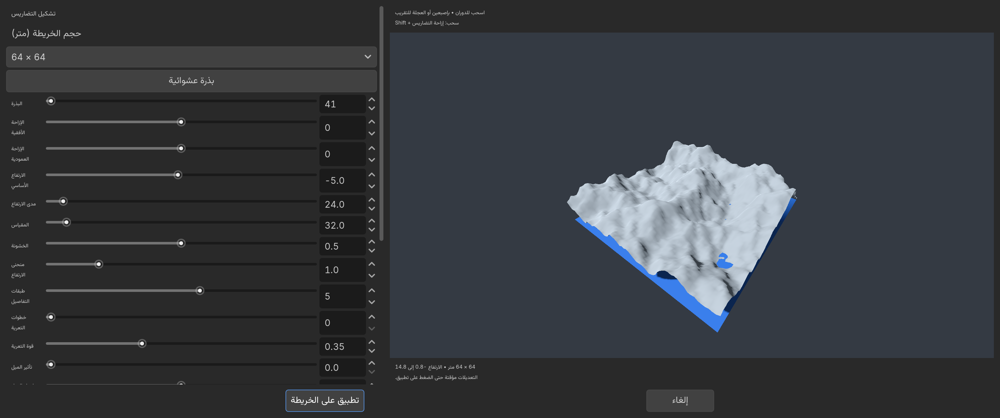
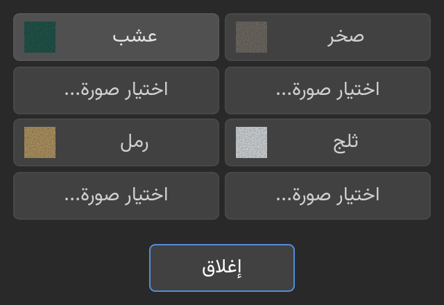

# LiteTerrain

A lightweight Godot terrain editor addon with English and Arabic interfaces, designed around touch-friendly editing.

By **ALSAHLY** · Version **0.4.1** · MIT license

## Features

- Sculpt, flatten and smooth terrain with five brush shapes.
- Paint four texture layers and replace their images in a dedicated texture window.
- Adjust brush radius and strength, with undo and redo.
- Generate terrain with an isolated 3D preview before applying changes.
- Choose 64, 128 or 256 meter maps.
- Paint foliage manually or scatter a specified number of plants.
- Use transparent grass textures as crossed X cards, or use Node3D scenes.
- Save foliage with the scene, align it with slopes and undo foliage strokes.
- Automatic terrain mesh LOD at runtime, texture mipmaps and clustered grass density LOD.
- Choose full-map collision or collision that follows a player node.

## Install

1. Copy `addons/lite_terrain` into your project's `addons` directory.
2. Open **Project → Project Settings → Plugins** and enable **LiteTerrain**.
3. Add a **LiteTerrain** node to a 3D scene and select it.
4. Choose **English** or **العربية** in the toolbar.

The installed plugin must be at `res://addons/lite_terrain/plugin.cfg`.

This repository contains the addon only, without a demo project.

## Quick start

Tap a texture swatch below the viewport to select a paint layer. **Edit images** opens a window with four **Choose image** buttons. The **Foliage brush** enables default grass painting; set a custom grass texture or a Node3D scene in the Inspector. Use **Invert** to erase plants.

**Generate terrain** opens the preview dialog. Scroll its settings column, adjust map size and terrain parameters, then choose **Apply to terrain**. Cancel leaves the scene unchanged. Drag the preview to orbit and use the wheel or pinch to zoom.

See the [bilingual manual](addons/lite_terrain/README.md) for collision, foliage, generation and touch controls.

## Compatibility and limits

Tested on **Godot 4.7.1**, Windows, using the Compatibility renderer. Touch input was tested with synthetic editor events; physical Android hardware has not yet been tested. Start with a 64 meter map on modest hardware. No native extensions are required.

Scene vegetation uses distance culling and any mesh LOD supplied by its imported models; the addon does not generate simplified versions of arbitrary scenes. Erosion is lightweight diffusion, and the sea is preview-only. Grass density LOD changes the number of visible instances at distance. The editor uses full terrain detail for accurate picking.

## Screenshots

## License and development

MIT License, Copyright (c) 2026 ALSAHLY. See [LICENSE](LICENSE).

Code and documentation were developed with AI assistance. Automated runtime/editor checks and Windows rendering checks were performed. Additional testing on Android devices is welcome.

---

## العربية

إضافة تضاريس خفيفة بواجهة عربية وإنجليزية وأزرار مناسبة للمس. تدعم تشكيل الأرض ورسم الخامات والعشب والأشجار والتوليد مع معاينة ثلاثية الأبعاد والتراجع والإعادة.

انسخ `addons/lite_terrain` إلى مشروعك، ثم فعّل LiteTerrain من إعدادات المشروع ← الإضافات. أضف عقدة LiteTerrain وحدّدها لإظهار الأدوات. زر «تعديل الصور» يفتح نافذة اختيار صور الخامات الأربع. تفاصيل الاستخدام في [الدليل العربي والإنجليزي](addons/lite_terrain/README.md).

اختُبرت على Godot 4.7.1 في Windows، ولم تُختبر بعد على هاتف فعلي. هذه حزمة الإضافة فقط دون مشروع أو ديمو.
